# what i do in project2
## 第一步先学会如何和codex一起写作业，不是让他帮我写好，而是一起完成

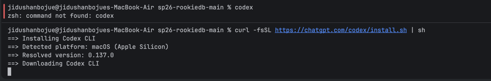
什么是cli？
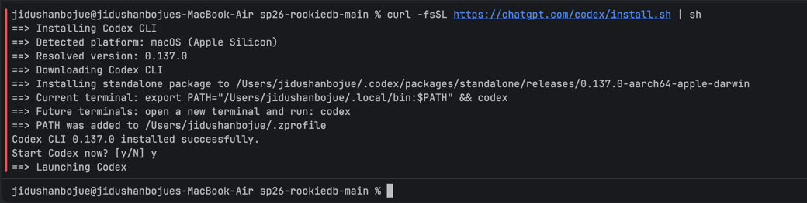

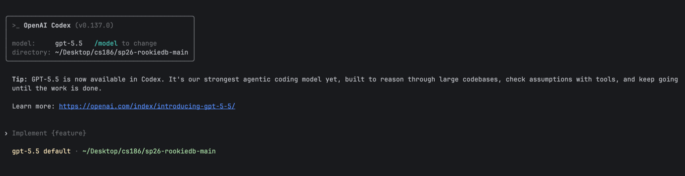

## project0先起步
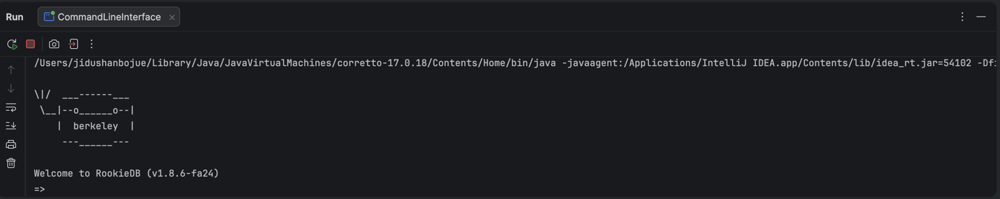
## task1
### 我不理解这里面的key是什么意思啊？
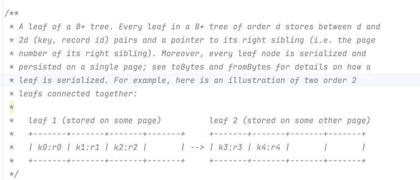
key就是我们在索引什么！
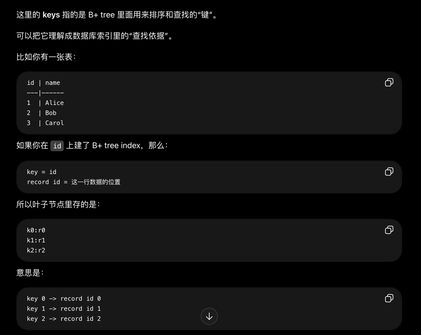

这个project主要是在写leafnode这个文件
所以我们可以先把这个fie看懂
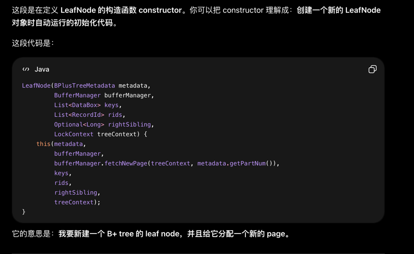
class里面定义一个构造函数construtor
这个this我还没有看懂啊？？？
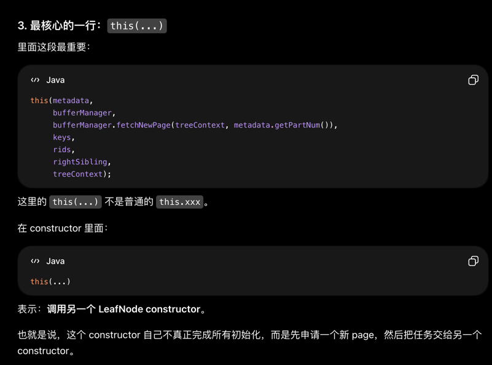
### 先来做一下这个一星上将，我终于知道为什么这个为什么project里面字那么少了，因为提示和解释全部在代码里面
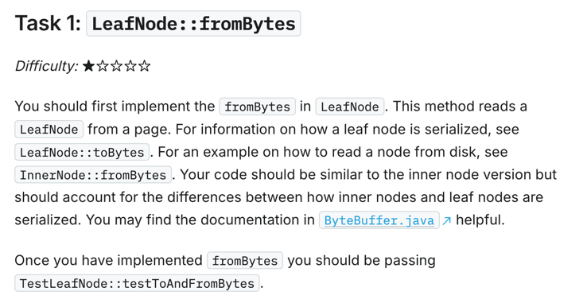
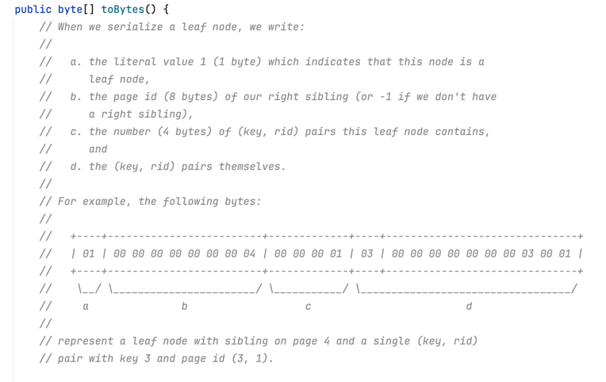
一个图片讲解了leafnode这个数据结构是如何存储的
但是c和d我没有看懂

题目让我去inner node里面去看如何找，如何从disk读取数据，
我不理解这里面读取的是哪个leafnode？
这个作业比我之前的难，是因为没有告诉我可以使用哪些函数（要我自己去找）
但是其实这些代码不难的，主要是要记忆，花时间去读完

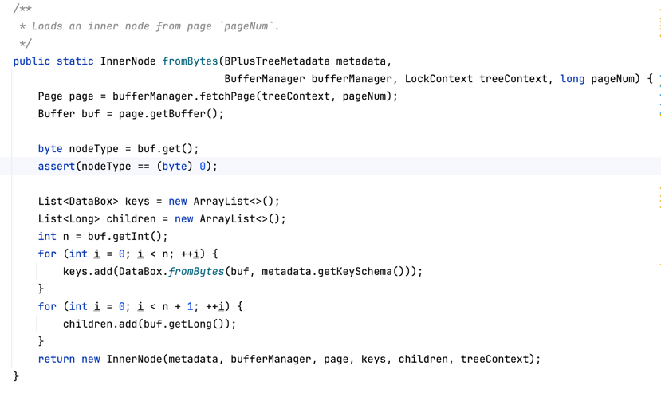
确实，你会发现inner都有！主要是inner和leaf的结构不一样

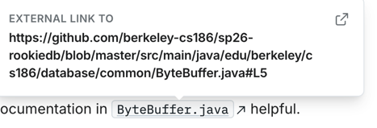
这个文件里面主要是如何处理bytes

```java
public static InnerNode fromBytes(BPlusTreeMetadata metadata,
                                      BufferManager bufferManager, LockContext treeContext, long pageNum) {
        Page page = bufferManager.fetchPage(treeContext, pageNum);
        Buffer buf = page.getBuffer();

        byte nodeType = buf.get();
        assert(nodeType == (byte) 0);

        List<DataBox> keys = new ArrayList<>();//这个如何理解？databox是一个类型
        List<Long> children = new ArrayList<>();
        int n = buf.getInt();
        for (int i = 0; i < n; ++i) {
            keys.add(DataBox.fromBytes(buf, metadata.getKeySchema()));
            //这里像是使用了一个递归，但是我没有看懂metadata.getKeySchema()
            //原来不是递归！
        }
        for (int i = 0; i < n + 1; ++i) {
            children.add(buf.getLong());
        }
        return new InnerNode(metadata, bufferManager, page, keys, children, treeContext);
    }

```
```java
keys.add(DataBox.fromBytes(buf, metadata.getKeySchema()))
```
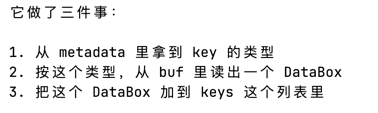
这个databox是一个很暧昧的变量
就是我也不知道是什么数据类型，就用databox统称吧！

我去这个task1我明白，赶紧速通睡觉了！
我主要是不熟悉一些变量类型，或者说我找不到，
但可以先点击command，然后会自动跳转到最初的定义去！
比如optional这个我感觉相当的抽象！
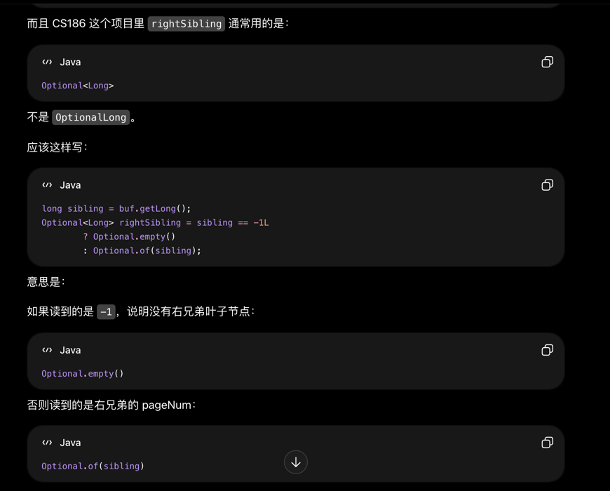

### 如何去测试test？
在IntelliJ setup for running tests里面有详细的教程
这个我先忽略
我先找一下测试一的错误
### mvn
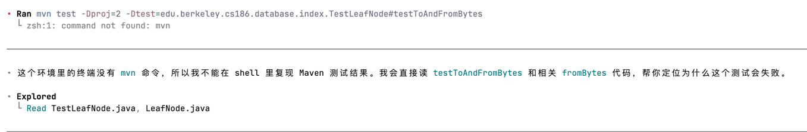
这个说要在zsh下载mvn？
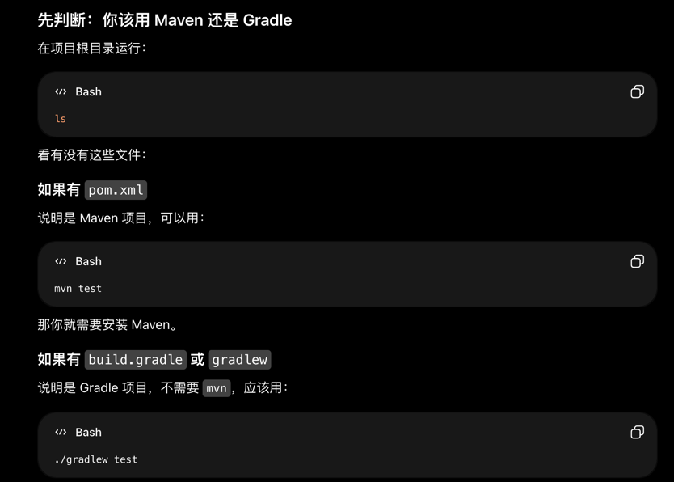
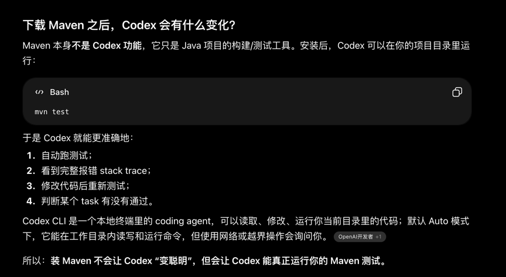

然后我希望你去学会读懂报错，去解决复杂的问题通过这些题目
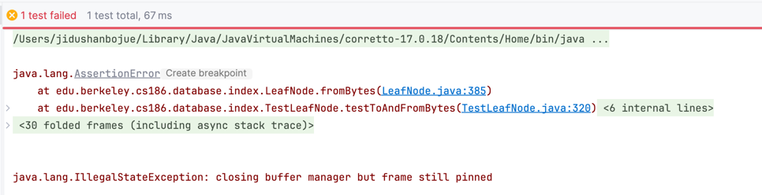

这个一开始我都看不懂是哪里出现问题了
是我的assert被触发了，你要先看第一个问题
改了之后终于把这个一星的题目做对了！
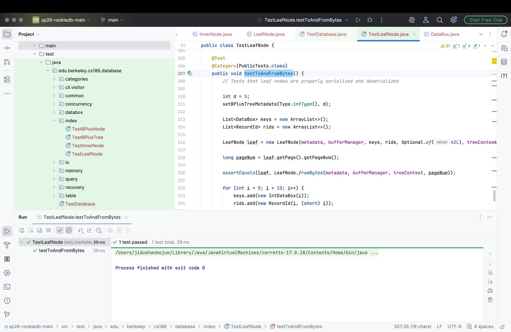

### task2
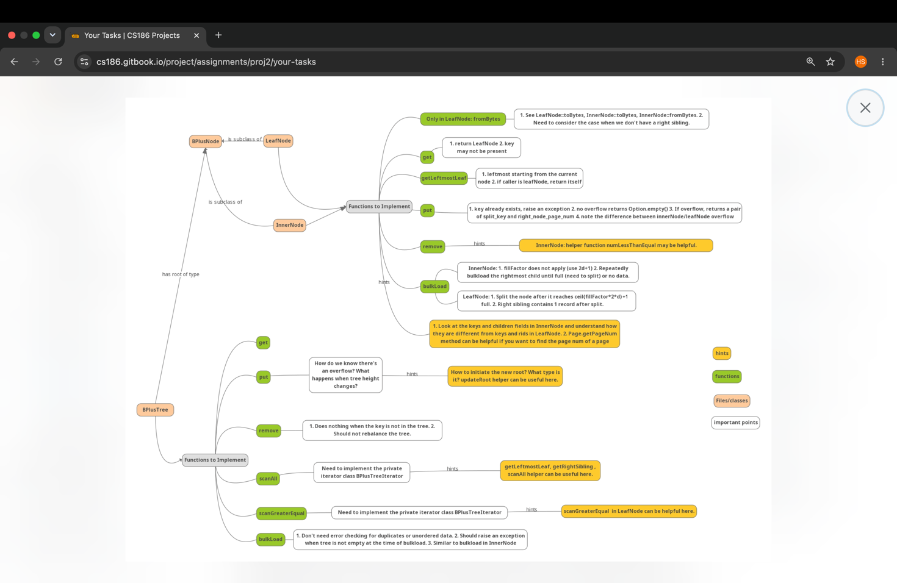
6.16遇到特别特别悲伤的事情！我失恋了，连朋友也做不了了
#### get函数
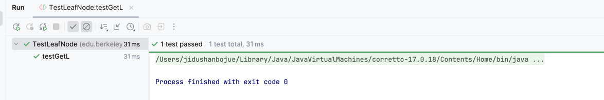
在codex的带领下，我终于把第一个get写完了！没有那么难嘛
#### getleftmost函数
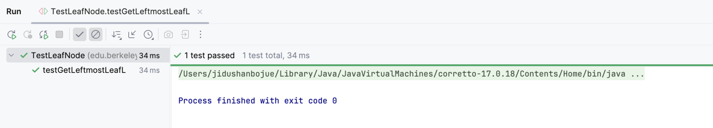
#### put
put 感觉很有难度啊
```java
private void sync() {
        page.pin();
        try {
            Buffer b = page.getBuffer();
            byte[] newBytes = toBytes();//注意，这里面的tobytes和buffer里面是什么是没有关系的！
            byte[] bytes = new byte[newBytes.length];
            b.get(bytes);//bytes代表了曾经的buffer里面存的数组
            if (!Arrays.equals(bytes, newBytes)) {//这个if减少了可能的写入
                page.getBuffer().put(toBytes());
            }
        } finally {
            page.unpin();
        }
    }

```

### Task 3: Scans
#### why we need a interator
为什么scanAll() 不能一次性把所有 RecordId 装进一个大 list 返回，因为项目要求 lazy scan
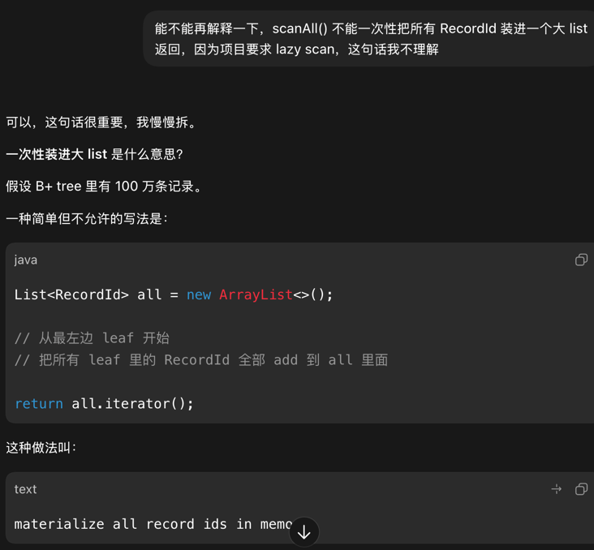

#### 一个经典的错误
```java
public boolean hasNext() {
            // TODO(proj2): implement
            if(currentIterator.hasNext()){
                return true;
            }
            if(!currentLeaf.getRightSibling().isPresent()){
                return false;//当前是最后一个leaf
            }
            BPlusTreeIterator next=new BPlusTreeIterator(currentLeaf.getRightSibling().get(),currentLeaf.getRightSibling().get().scanAll());
            return next.hasNext();

        }
```
####
这个interator很神奇，就像是贴在数组上的标签一样，next（）函数返回当前标签的数，然后标签往后移动一位

### Task 4: bulk load批量加载（我一开始都不知道中文
一开始我觉得很抽象的是我不知道这个函数在干什么事情，其实是批量加载
。然后每个结构体inner，leaf的bulkload都不一样，可以说是各司其职了


#### 太好了，project2杀青了，我写了有半个月，主要是中间有十天太伤心了，也不想写这个东西
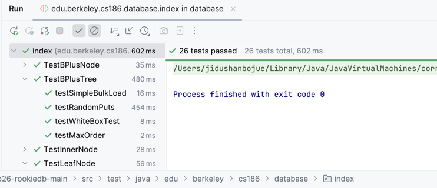
2026.6.27
